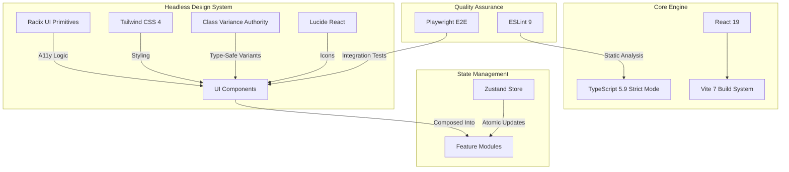

# Enterprise Data Client (EDC)


**A high-performance, accessible frontend architecture designed for enterprise financial analytics.**

This repository represents the **Client Layer** of the Enterprise Data Visualization Platform. It is engineered using a **Headless UI** philosophy, prioritizing accessibility (a11y), type safety, and rendering performance for high-frequency data updates.

---

## 🏗 Architecture & Design System

This project moves away from monolithic UI frameworks in favor of a composable, **headless architecture** using Radix Primitives and Tailwind v4.



---

## ⚡ Tech Stack & Rationale

### Core Framework
* **[React 19](https://react.dev/):** Utilizing the latest concurrent rendering features for non-blocking UI updates.
* **[Vite 7](https://vitejs.dev/):** Next-generation frontend tooling for instant HMR.
* **[TypeScript 5.9](https://www.typescriptlang.org/):** Enforcing strict type safety across the entire application domain.

### Design System (Headless)
* **[@radix-ui/react-*](https://www.radix-ui.com/):** Unstyled, accessible components (Collapsible, ScrollArea, Tabs, Dialogs) that handle ARIA roles and keyboard navigation.
* **[Tailwind CSS 4](https://tailwindcss.com/):** Zero-runtime utility CSS for high-performance styling.
* **[class-variance-authority](https://cva.style/):** Managing component variants (e.g., button sizes, intent) with full TypeScript support.
* **[lucide-react](https://lucide.dev/):** Tree-shakeable, consistent icon set.

### State & Utilities
* **[zustand](https://github.com/pmndrs/zustand):** Minimalist state management for global UI state.
* **[clsx](https://github.com/lukeed/clsx) & [tailwind-merge](https://github.com/dcastil/tailwind-merge):** Utilities for conditional class merging without style conflicts.

---

## 🚀 Getting Started

### Prerequisites
* Node.js 20+ (LTS Recommended)
* pnpm (Required)

### Installation

```bash
# Clone the repository
git clone [https://github.com/Enterprise-Data-Visualisation/react-client.git](https://github.com/Enterprise-Data-Visualisation/react-client.git)

# Install dependencies
pnpm install
```

### Available Scripts

| Command | Description |
| :--- | :--- |
| `pnpm dev` | Starts the Vite development server. |
| `pnpm build` | Compiles the application using TypeScript and Vite for production. |
| `pnpm preview` | Locally previews the production build. |
| `pnpm lint` | Runs ESLint to identify code quality issues. |
| `pnpm lint:fix` | Automatically fixes ESLint errors. |
| `pnpm format` | Formats code using Prettier. |
| `pnpm format:check` | Checks if code is correctly formatted. |

---

## 🧪 Testing (Playwright)

We use **Playwright** for robust End-to-End (E2E) testing to ensure critical user flows work across all browsers.

```bash
# Run all E2E tests (Headless mode)
pnpm test:e2e

# Run tests with UI Debugger (Interactive Mode)
pnpm test:e2e:ui

# Run tests in a headed browser (Visual Mode)
pnpm test:e2e:headed
```

---

## 📂 Project Structure

The project follows a **Feature-First** architecture to ensure maintainability at scale.

```text
src/
├── components/         # Shared UI components
│   └── ui/             # Radix + Tailwind primitives (Button, ScrollArea, Tabs)
├── features/           # Domain-specific logic
│   ├── dashboard/      # Analytics dashboard views
│   ├── assets/         # Asset management tables
│   └── auth/           # Authentication flows
├── store/              # Zustand atomic stores
├── lib/                # Utilities (cn, tailwind-merge)
├── types/              # Global TypeScript definitions
└── tests/              # Playwright E2E test specs
```

---
*Maintained by [Archit Gupta](https://github.com/architg564) - Senior Frontend Engineer*
